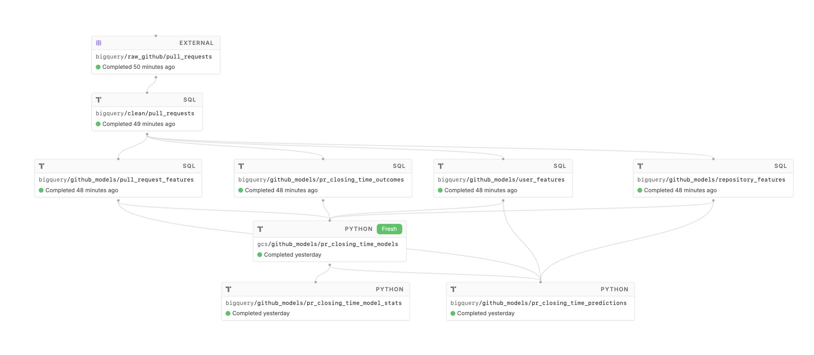
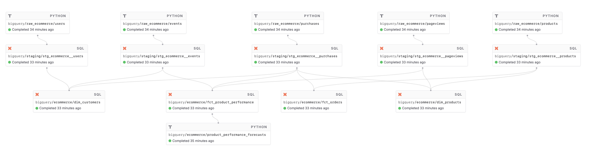
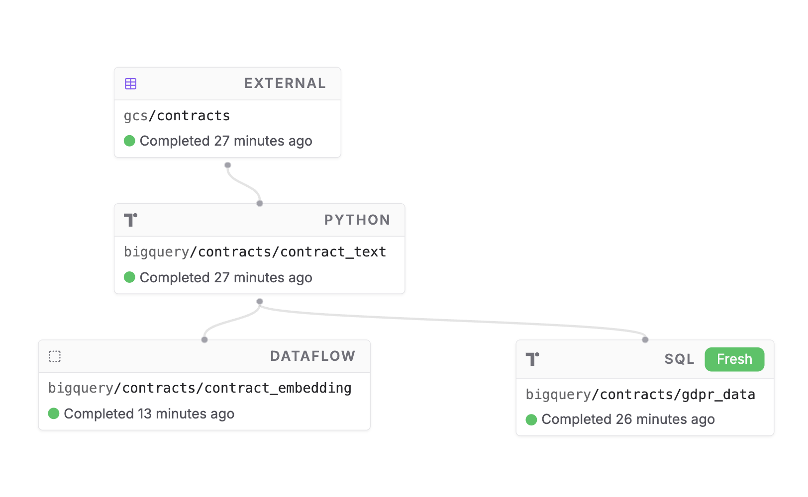

# Twirl examples

This respository contains real working examples of Twirl code, to show what the developer experience is like and suggest patterns for working with data inside an orchestrator like Twirl. The examples are set up as a single working Twirl project, showing that multiple work streams can co-exist together in one place.


#### Github PR closing time predictions

This example uses Github pull request data to make predictions about how quickly a pull request will close, demonstrating how to train a model on data living in BigQuery, store the model results in GCS, and use the most recently trained model to make a prediction for new requests.

* Tag: `github_predictions`

* Included assets:

```sh
❯ twirl list @github_predictions
    bigquery/raw_github/pull_requests
    bigquery/clean/pull_requests
    bigquery/github_models/pr_closing_time_outcomes
    bigquery/github_models/pull_request_features
    bigquery/github_models/repository_features
    bigquery/github_models/user_features
    gcs/github_models/pr_closing_time_models
    bigquery/github_models/pr_closing_time_model_stats
    bigquery/github_models/pr_closing_time_predictions
```

* Visualization:



* Features demonstrated:
    - Machine learning
    - [File collections](https://docs.twirldata.com/development/testing#file-collections)
    - [Schemas](https://docs.twirldata.com/concepts/tables#schemas)
    - [Job specific CPU/Mem resources](https://docs.twirldata.com/deployment/compute-resources#job-resource-configuration)


#### Ecommerce

This example shows a realistic example of combining [dbt](https://www.getdbt.com/) modeling and Python based machine learning with [Prophet](https://facebook.github.io/prophet/) to forecast the performance of various ecommerce products based on the recent past. The example begins by pulling data from a postgres database, showing how to use Twirl state to do so easily.

* Tag: `ecommerce`

* Included assets:
```sh
❯ twirl list @ecommerce
    bigquery/raw_ecommerce/events
    bigquery/raw_ecommerce/pageviews
    bigquery/raw_ecommerce/products
    bigquery/raw_ecommerce/purchases
    bigquery/raw_ecommerce/users
    stg_ecommerce__events
    stg_ecommerce__pageviews
    stg_ecommerce__products
    stg_ecommerce__purchases
    stg_ecommerce__users
    dim_customers
    dim_products
    fct_orders
    fct_product_performance
```

* Visualization:



* Features demonstrated:
    - Data ingestion from Postgres
    - [dbt integration](https://docs.twirldata.com/integrations/twirl-with-dbt)
    - [Schemas](https://docs.twirldata.com/concepts/tables#schemas)
    - [Job State](https://docs.twirldata.com/development/state)
    - [Append update method](https://docs.twirldata.com/concepts/jobs#append)
    - [Merge update method](https://docs.twirldata.com/concepts/jobs#merge)


#### Document / PDF processing

This example leverages Python and Dataflow to process a series of contracts saved as PDF files, generate embeddings for every page of the files and scan them for any mention of GDPR along with page number for where those references occurred, showcasing how Twirl can be used in a legal tech setting.

* Tag: `legal`

* Included assets:

```sh
❯ twirl list @legal
    gcs/contracts
    bigquery/contracts/contract_text
    bigquery/contracts/contract_embedding
    bigquery/contracts/gdpr_data
```

* Visualization:



* Features demonstrated:
    - [Job specific requirements.txt](https://docs.twirldata.com/development/containers#requirements-file)
    - Combining BigQuery and GCS to process and structure non-tabular data
    - Using Google Cloud Dataflow for tasks that require more distributed processing power

Please explore the `bigquery`, `dbt`, and `gcs` directories to see example code. Feel free to also check out the `project_config.py`, detailing Twirl's configuration. Note how little is needed for the dbt integration!
